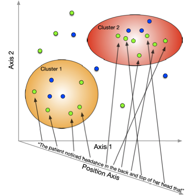

# Unsupervised Position-Based Semantic Matching

[![PyPI][pypi-badge]][pypi-link]
[![Python 3.11][python311-badge]][python311-link]
[![Build Status][build-badge]][build-link]

An API to match spans of semantically similar text across documents.  Each
match is a span of text in a source document and another span of text in a
target document that are both tied together.

<!-- markdown-toc start - Don't edit this section. Run M-x markdown-toc-refresh-toc -->
## Table of Contents

- [Introduction](#introduction)
- [Documentation](#documentation)
- [Usage](#usage)
- [Citation](#citation)
- [Obtaining](#obtaining)
- [Changelog](#changelog)
- [License](#license)

<!-- markdown-toc end -->


## Introduction

Spans are formed by a weighted combination of the semantic similarity of the
each document's text and the token position.  Hyperparameters are used to
control which take precedent (semantic similarity or token position for longer
contiguous token spans).

This is done using position embeddings on a third (see Figure 1) axis shows
data blue word embeddings moving from cluster 1 to cluster 2. Cluster spans the
discharge summaries (orange), the note antecedent (green) and arrows connecting
the tokens to word points.



*Figure 1*

For more information, see the "Hybrid Semantic Positional Token Clustering"
section in our paper [Hospital Discharge Summarization Data Provenance].  This
paper's primary repository is [here](https://github.com/uic-nlp-lab/dsprov).


## Documentation

See the [full documentation](https://plandes.github.io/spanmatch/index.html).
The [API reference](https://plandes.github.io/spanmatch/api.html) is also
available.


## Usage

```python
from zensols.cli import CliHarness
from zensols.nlp import FeatureDocument, FeatureDocumentParser
from zensols.spanmatch import Match, MatchResult, Matcher, ApplicationFactory

SOURCE = """\
Johannes Gutenberg (1398 – 1468) was a German goldsmith and publisher who
introduced printing to Europe. His introduction of mechanical movable type
printing to Europe started the Printing Revolution and is widely regarded as the
most important event of the modern period. It played a key role in the
scientific revolution and laid the basis for the modern knowledge-based economy
and the spread of learning to the masses.

Gutenberg many contributions to printing are: the invention of a process for
mass-producing movable type, the use of oil-based ink for printing books,
adjustable molds, and the use of a wooden printing press. His truly epochal
invention was the combination of these elements into a practical system that
allowed the mass production of printed books and was economically viable for
printers and readers alike.
"""

SUMMARY = """\
The German Johannes Gutenberg introduced printing in Europe. His invention had a
decisive contribution in spread of mass-learning and in building the basis of
the modern society.
"""

harness: CliHarness = ApplicationFactory.create_harness()
doc_parser: FeatureDocumentParser = harness['spanmatch_doc_parser']
matcher: Matcher = harness['spanmatch_matcher']
source: FeatureDocument = doc_parser(SOURCE)
summary: FeatureDocument = doc_parser(SUMMARY)
# shorten source doc span length by scaling up positional importance
matcher.hyp.source_position_scale = 2.5
# elongate summary doc span length by scaling up positional importance
matcher.hyp.target_position_scale = 0.9
res: MatchResult = matcher(source, summary)
match: Match
for i, match in enumerate(res.matches[:5]):
	match.write(include_flow=False)
```

Output:

```abnf
2023-06-11 08:22:38,392 24 matches found
source (0, 55):
    Johannes Gutenberg (1398 – 1468) was a German goldsmith
target (4, 29):
    German Johannes Gutenberg
source (524, 631):
    type, the use of oil-based ink for printing books, adjustable molds, and the use
    of a wooden printing press
target (4, 59):
    German Johannes Gutenberg introduced printing in Europe
source (301, 421):
    scientific revolution and laid the basis for the modern knowledge-based economy
    and the spread of learning to the masses
target (106, 177):
    spread of mass-learning and in building the basis of the modern society
source (516, 585):
    movable type, the use of oil-based ink for printing books, adjustable
target (116, 169):
    mass-learning and in building the basis of the modern
source (168, 199):
    started the Printing Revolution
target (106, 145):
    spread of mass-learning and in building
```


## Obtaining

The easiest way to install the command line program is via the `pip` installer:
```bash
pip3 install --use-deprecated=legacy-resolver zensols.spanmatch
```

Binaries are also available on [pypi].


## Citation

If you use this project in your research please use the following BibTeX entry:

```bibtex
@inproceedings{landesHospitalDischargeSummarization2023,
  title = {Hospital {{Discharge Summarization Data Provenance}}},
  booktitle = {The 22nd {{Workshop}} on {{Biomedical Natural Language Processing}} and {{BioNLP Shared Tasks}}},
  author = {Landes, Paul and Chaise, Aaron and Patel, Kunal and Huang, Sean and Di Eugenio, Barbara},
  date = {2023-07},
  pages = {439--448},
  publisher = {{Association for Computational Linguistics}},
  location = {{Toronto, Canada}},
  url = {https://aclanthology.org/2023.bionlp-1.41},
  urldate = {2023-07-10},
  eventtitle = {{{BioNLP}} 2023}
}
```


## Changelog

An extensive changelog is available [here](CHANGELOG.md).


## License

[MIT License](LICENSE.md)

Copyright (c) 2023 - 2025 Paul Landes


<!-- links -->
[pypi]: https://pypi.org/project/zensols.spanmatch/
[pypi-link]: https://pypi.python.org/pypi/zensols.spanmatch
[pypi-badge]: https://img.shields.io/pypi/v/zensols.spanmatch.svg
[python311-badge]: https://img.shields.io/badge/python-3.11-blue.svg
[python311-link]: https://www.python.org/downloads/release/python-3110
[build-badge]: https://github.com/plandes/spanmatch/workflows/CI/badge.svg
[build-link]: https://github.com/plandes/spanmatch/actions

[Hospital Discharge Summarization Data Provenance]: https://aclanthology.org/2023.bionlp-1.41/
